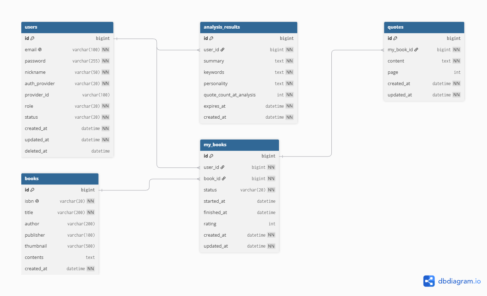

# Readcovery

> **read + discovery** — 인용구로 나를 발견하는 독서 기록 서비스

## 소개

좋은 문장을 모으는 사람은 많지만, 그 문장들이 자신에 대해 무엇을 말해주는지 돌아볼 기회는 적습니다.
Readcovery는 사용자가 모은 인용구를 AI로 분석해 독자 자신의 관심사와 가치관을 비춰주는 거울이 되고자 합니다.

## 주요 기능 (MVP)
1. 회원가입 / 로그인 (JWT 기반 인증)
2. 책 검색 (카카오 책 검색 API)
3. 내 서재 관리 (읽고 싶은 / 읽는 중 / 완독)
4. 책별 인용구 등록 / 조회 / 삭제
5. AI 기반 독서 분석 (한 줄 요약 / 키워드 / 독서 성향, 7일 캐시)

> 백엔드 + 프론트엔드 모두 구현 완료. 배포만 남은 상태.

##  추가 예정 기능

- 인용구 전문 검색
- 독서 통계 (월별 / 장르별)
- 이메일 알림
- 인용구 공개 피드

## 기술 스택

### Backend
- Java 17
- Spring Boot 4.0.6
- Spring Data JPA
- Spring Security + JWT
- MySQL 8.0

### Frontend
- React 18 + TypeScript
- Vite
- Tailwind CSS v4
- React Router
- Axios

### 외부 API
- 카카오 책 검색 API
- OpenAI API

### 인프라 (예정)
- AWS EC2 / RDS / S3
- Redis (캐싱)
- Docker
- GitHub Actions (CI/CD)

## ERD



5개 엔티티로 구성:
- **User** — 회원 정보, 소프트 삭제 지원
- **Book** — 책 정보 (ISBN unique, 카카오 응답 기반)
- **MyBook** — 사용자별 서재 (User × Book 조합, unique 제약)
- **Quote** — MyBook에 종속된 인용구 (cascade 삭제)
- **AnalysisResult** — User 단위 AI 분석 결과 캐시

## 기술 결정 노트

### 인증(Authentication)과 인가(Authorization) 분리
- 인증: JWT로 "누구인지" 식별 (JwtAuthenticationFilter)
- 인가: 서비스 레이어에서 "이 리소스에 접근할 권한이 있는지" 검증
  (예: Quote 추가 시 myBook의 소유자와 토큰의 userId 일치 확인)
- 인증 실패는 401(Unauthorized), 인가 실패는 403(Forbidden)으로 구분

### 인증 실패 응답을 401로 명확화
- Spring Security 기본 동작은 인증되지 않은 접근에도 403을 반환하는 경우가 있음
- AuthenticationEntryPoint를 커스텀해 의미에 맞는 401 + JSON 메시지로 응답

### MyBook-Quote 양방향 관계 + cascade 삭제
- MyBook이 삭제되면 종속된 Quote도 함께 삭제되어야 함
- `@OneToMany(mappedBy="myBook", cascade=CascadeType.REMOVE, orphanRemoval=true)`로 부모-자식 생명주기 통합
- CascadeType.ALL 대신 REMOVE만 명시해 의도하지 않은 INSERT/UPDATE 전파 방지
- 양방향 관계의 함정(JSON 무한 순환)에 대한 이중 방어:
  1차 — 모든 응답을 DTO로 변환해 엔티티 자체가 응답에 노출되지 않음
  2차 — Quote.myBook에 @JsonIgnore로 만약의 직접 직렬화 차단
- AnalysisResult는 Quote를 직접 참조하지 않아 cascade 영향 없음

### AI 분석 캐싱 전략
- AnalysisResult는 시점의 텍스트 요약(summary/keywords/personality)으로 저장
- 만료 조건: 분석 후 7일 경과, 또는 인용구 5개 추가 시 재생성 필요로 판단
- 캐시 hit 시 OpenAI 미호출로 비용 절감 + 응답 속도 1초 미만
- 동일 사용자의 반복 분석 요청에 from_cache 플래그로 클라이언트가 캐시 상태 인지

### 단일 리소스 조회 API의 RESTful 일관성
- GET /api/my-books/{id}를 목록 API와 세트로 추가
- 프론트엔드에서 "목록 → 상세" 진입 시 명확한 단일 호출로 의도가 드러남
- 소유권 검증을 Controller가 아닌 Service 레이어에서 일관 처리
- 향후 캐싱 전략 적용 시 단일 리소스 단위로 캐시 키 설계 가능

## 트러블슈팅

### Git 머지 충돌 해결 - .gitignore 파일
- 상황: GitHub에서 레포 생성 시 Java 템플릿으로 `.gitignore`가 자동 생성됨.
  동시에 Spring Initializr에서 다운로드한 프로젝트에도 Gradle 전용 `.gitignore`가 포함되어
  `git pull` 시 충돌 발생.
- 원인: 동일 파일이 양쪽 저장소에 독립적으로 생성되어 git이 자동 병합 불가.
- 해결: 두 파일을 비교한 결과, Spring Initializr 버전이 IntelliJ/Gradle 환경에 더 적합해
  로컬 버전을 채택. 추가로 비밀 정보 파일(`application-secret.yml`, `.env`) 무시 규칙을 보강.
- 배운 점: `.gitignore`처럼 두 환경에서 독립적으로 생성될 수 있는 파일은 한쪽에서만
  관리하거나, 초기 셋업 시 한 곳을 비워두는 게 안전함.

### WebClient의 baseUrl이 무시되는 케이스
- 상황: WebClient에 baseUrl을 설정했지만 카카오 API 호출 시 Connection refused 발생
- 원인: URI 객체로 uri() 호출하면 baseUrl이 무시됨. UriComponentsBuilder로 만든
  URI에는 호스트 정보가 없어서 localhost로 요청이 나감
- 해결: uri(Function<UriBuilder, URI>) 람다 방식으로 변경. WebClient 내부 빌더는
  baseUrl을 자동 적용함
- 배운 점: WebClient의 uri() 메서드는 인자 타입에 따라 baseUrl 적용 여부가 달라짐.
  String 또는 람다 사용이 안전

### Jackson SNAKE_CASE 전략과 요청 필드 매핑 불일치
- 상황: MyBook 등록 시 userId, bookId가 계속 null로 들어와 검증 실패(400).
  회원가입, 책 등록은 정상이었음.
- 원인: 카카오 API 연동 시 추가한 jackson.property-naming-strategy: SNAKE_CASE 설정 때문.
  Jackson이 자바 camelCase 필드(userId)를 JSON snake_case(user_id)로 기대하는데,
  요청은 camelCase로 보내서 매핑 실패. email, isbn처럼 단어 하나인 필드는
  두 표기가 같아 문제가 드러나지 않다가, userId처럼 합성어에서 처음 발생.
- 해결: API 요청/응답을 snake_case로 통일 (REST 관례에도 부합).
- 배운 점: 전역 네이밍 전략은 모든 DTO에 영향을 미치므로, 외부 API 응답 매핑을 위해
  도입할 때 자체 API의 요청/응답 규약도 함께 통일해야 함.

### WebClient와 전역 Jackson 설정의 불일치
- 상황: OpenAI Chat Completions API 호출 시 "Unrecognized request argument supplied: responseFormat"
  400 에러 발생. 로그로 직접 직렬화한 JSON은 snake_case로 정상 표시되었으나,
  WebClient가 실제로 보낸 요청은 camelCase였음.
- 원인: application.yml의 jackson.property-naming-strategy: SNAKE_CASE 전역 설정이
  ObjectMapper에는 적용되지만, WebClient 내부 직렬화 코덱에는 자동 반영되지 않는 케이스.
  (Spring Boot 4 + Jackson 3 환경)
- 진단: onStatus로 OpenAI의 에러 응답 본문을 직접 로깅 + ObjectMapper로 요청 JSON 별도 로깅
  → 두 JSON이 다르다는 사실 확인.
- 해결: OpenAiChatRequest의 responseFormat 필드에 @JsonProperty("response_format") 명시.
  전역 설정에 의존하지 않고 외부 API 명세에 맞는 정확한 필드명을 코드에 박음.
- 배운 점: 외부 API에 보낼 DTO는 전역 직렬화 설정에 기대지 않고 @JsonProperty로 명시하는 게
  안전. 특히 WebClient는 내부 코덱이 별도라 환경 의존성이 숨어 있을 수 있음.
- 디버깅 인사이트: 외부 API 호출 시 onStatus로 에러 응답 본문을 명시적으로 로깅하면
  외부 서비스가 알려주는 진짜 원인을 직접 읽을 수 있어 디버깅 시간이 크게 단축됨.

### React 19의 FormEvent deprecation과 SubmitEventHandler 전환
- 상황: React 19.2.10부터 FormEvent / FormEventHandler가 deprecated 표시.
  IDE에 취소선이 표시되었음.
- 진단: 추측하지 않고 검색으로 공식 deprecation 노트 확인.
  SubmitEvent / SubmitEventHandler가 대체 타입.
- 해결: `React.FormEventHandler<HTMLFormElement>` →
  `React.SubmitEventHandler<HTMLFormElement>`로 전환.
  매개변수가 아닌 함수 자체에 핸들러 타입을 부여하는 방식이 React 권장 패턴.
- 배운 점: IDE의 deprecated 표시는 단순 경고가 아니라 곧 제거될 API 신호.
  새 표준 익혀두면 미래 버전 호환성 확보 가능.

### useEffect 함수 호출 위치와 ESLint 경고
- 상황: MyLibraryPage가 "불러오는 중..." 상태에서 멈춤. 데이터 fetch가 진행되지 않음.
- 진단: ESLint가 `'fetchLibrary' is assigned a value but never used` 경고 출력.
  "정의는 했는데 외부에서 호출 안 했다"는 신호.
- 원인: `fetchLibrary()` 호출문이 함수 정의 내부에 들어가 있어 useEffect 실행 시
  함수 정의만 되고 실제 호출은 일어나지 않았음.
- 해결: 호출문을 함수 정의 밖, useEffect 콜백의 마지막 라인으로 이동.
- 배운 점: ESLint 경고는 단순 코드 스타일 지적이 아닌 잠재적 버그 신호.
  특히 'never used' 계열은 의도와 실제 동작이 어긋났을 가능성이 큼.

### 외부 응답 데이터의 타입 안정성 — extractErrorMessage 오타 사례
- 상황: 백엔드가 정확한 에러 메시지("이미 서재에 담은 책입니다.")를 응답하는데
  프론트는 fallback 메시지만 표시.
- 진단: Network 탭으로 응답 본문 확인 (백엔드 정상) → 코드 흐름 추적 →
  `data.messages`(s 붙은 오타)로 접근해 undefined 반환 후 fallback 분기 진입.
- 원인: axios 응답의 data는 타입 정보가 약해 속성 오타가 컴파일 시점에 잡히지 않음.
- 해결: ErrorResponseData 인터페이스 정의 + `as ErrorResponseData`로 타입 좁힘.
  속성 오타가 IDE에서 즉시 빨간 줄로 표시됨.
- 배운 점: 외부 응답 영역까지 타입 시스템을 확장하면 휴먼 에러를 컴파일러가
  잡아줌. 백엔드의 응답 형식이 일관되면 충분히 명시 가능.

## 실행 방법

### 사전 요구사항
- Java 17 이상
- MySQL 8.0
- Spring Boot 4.0.6

### 1. 데이터베이스 준비
```sql
CREATE DATABASE readcovery DEFAULT CHARACTER SET utf8mb4 COLLATE utf8mb4_unicode_ci;
```

### 2. 비밀 정보 설정
`src/main/resources/application-secret.yml` 파일을 생성하고 다음 내용을 입력:

```yaml
spring:
  datasource:
    password: 본인_MySQL_비밀번호

kakao:
  api-key: 본인_카카오_REST_API_키

jwt:
  secret: 무작위_영숫자_최소_32자_이상
  access-token-validity: 3600000
```

> ⚠️ `application-secret.yml`은 `.gitignore`에 등록되어 있어 Git에 포함되지 않습니다.
> 비밀 정보는 절대 코드에 직접 작성하지 않도록 주의합니다.
> 
> 


### 3. 애플리케이션 실행
```bash
./gradlew bootRun
```
### 4. 프론트엔드 실행 (별도 터미널)
```bash
cd frontend
npm install
npm run dev
```

브라우저에서 `http://localhost:5173` 접속.

> 백엔드(8080)와 프론트엔드(5173)는 별도 프로세스로 실행됩니다.
> 백엔드 SecurityConfig의 CORS가 5173을 허용하도록 설정되어 있어야 합니다.

## 향후 개발 계획

### 배포
- AWS EC2 + RDS 환경 구축
- Docker 컨테이너화
- GitHub Actions CI/CD

### 코드 품질
- 단위 테스트 도입 (JUnit + Spring Boot Test)
- 통합 테스트 (인용구 등록 → 분석 호출 전체 흐름)
- 프론트엔드 컴포넌트 테스트 (Vitest + Testing Library)

### 추가 기능
- 인용구 전문 검색
- 독서 통계 (월별 / 장르별)
- 이메일 알림 (분석 결과 갱신 시)
- 인용구 공개 피드